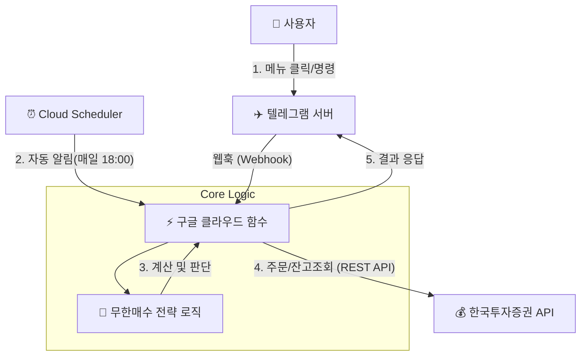

# 무한매수 람다 텔레그램 봇 (Serverless Infinite Hantu)

이 프로젝트는 라오어의 **무한매수법(Infinite Buying Strategy)**을 **구글 클라우드 함수(Google Cloud Functions)**와 **텔레그램(Telegram)**을 이용하여 서버 없이(Serverless), 비용 없이 운영할 수 있도록 만든 초경량 트레이딩 봇입니다.

## 1. 프로젝트 개요

- **목표**: 개인 PC나 서버를 24시간 켜둘 필요 없이, 클라우드 상에서 자동으로 매매 로직을 수행하고 텔레그램으로 제어합니다.
- **핵심 기능**:
    - **자동 알림**: 매일 프리장 시작 전("오후 6시" 등) 봇이 먼저 말을 걸어 매매 준비를 알립니다.
    - **간편 메뉴**: 텔레그램 버튼(Menu)을 통해 계좌 조회, 사이클 상태 확인, 주문 예약을 원터치로 수행합니다.
    - **무비용**: Google Cloud Free Tier 범위 내에서 동작하므로 유지 비용이 거의 들지 않습니다 (월 200만 회 호출 무료).

## 2. 시스템 아키텍처

사용자는 텔레그램을 통해 봇과 소통하며, 실제 로직은 Google Cloud Functions(서버리스)에서 수행됩니다.



## 3. 주요 기능 (텔레그램 메뉴)

봇은 다음과 같은 4가지 핵심 버튼을 제공합니다.

1.  **📊 1. 계좌 조회**
    - 현재 내 계좌의 잔고, 평가금액, 수익률, 보유종목(SOXL) 정보를 보여줍니다.
2.  **🔄 2. 사이클 상황보고**
    - 무한매수법의 핵심인 **현재 진행 회차(T)**, **진행률(%)**, **목표 매도가**, **Star 가격**을 계산하여 보고합니다.
3.  **📅 3. 오늘의 주문예약**
    - 오늘 내야 할 **매수 주문(LOC/평단매수)**과 **매도 주문(목표가/Star매도)**을 계산해서 알려줍니다.
    - (추후 기능) "실행" 버튼을 누르면 즉시 예약 주문을 전송할 수 있습니다.
4.  **📝 4. 오늘의 체결상황**
    - 오늘 하루 동안 체결된 매수/매도 내역을 조회합니다.

## 4. 폴더 구조 (`src_tele_lambda`)

구글 클라우드에 배포하기 위해 최적화된 폴더 구조입니다. 기존 프로젝트의 핵심 로직을 그대로 재사용합니다.

```text
src_tele_lambda/
├── main.py                # [핵심] 클라우드 함수 진입점 (텔레그램 웹훅 처리)
├── requirements.txt       # 의존성 패키지 목록 (requests, python-telegram-bot 등)
├── config/
│   └── config.yaml        # 설정 파일 (API 키, 토큰, 계좌번호 등)
└── src_rev/               # [로직] 기존 프로젝트에서 가져온 핵심 모듈
    ├── domain/            # 무한매수 전략 계산 로직
    └── infrastructure/    # 한국투자증권 API 연동 모듈
```

## 5. 배포 가이드 (Deployment Guide)

구글 클라우드를 처음 사용하는 분들을 위한 단계별 가이드입니다.

### 5.1 사전 준비 사항
1.  **Google Cloud Platform (GCP) 계정**: [console.cloud.google.com](https://console.cloud.google.com)
2.  **프로젝트 생성**: GCP 콘솔에서 새 프로젝트 생성 (예: `infinite-hantu-bot`)
3.  **한국투자증권 API Key**: 실전/모의투자 API Key 및 Secret
4.  **텔레그램 봇 토큰**: BotFather를 통해 생성한 Bot Token

### 5.2 설정 파일 작성 (`config/config.yaml`)
`src_tele_lamda/config/config.yaml` 파일을 열어 본인의 정보를 입력하세요.

```yaml
trading:
  infinite_buying_strategy:
    symbol: "SOXL"
    division_count: 40
    # ... 기타 전략 설정

telegram:
  bot_token: "YOUR_TELEGRAM_BOT_TOKEN"
  chat_id: "YOUR_CHAT_ID"  # 봇과 대화방의 ID (userinfobot 등으로 확인)

api:
  app_key: "YOUR_KIS_APP_KEY"
  app_secret: "YOUR_KIS_APP_SECRET"
  account_number: "1234567801" # 계좌번호 10자리 (8자리+2자리)
  is_virtual: true             # 모의투자: true, 실전: false
```

### 5.3 Google Cloud Functions 배포

1.  **Google Cloud SDK 설치**: `gcloud` 명령어를 사용하기 위해 SDK를 설치하고 로그인합니다.
2.  **배포 명령어 실행**:
    `src_tele_lamda` 폴더로 이동한 후 터미널에서 다음 명령어를 실행합니다.

    ```bash
    # 처음 배포 시 Cloud Build API 등을 활성화하라는 메시지가 나오면 'y'를 입력하세요.
    gcloud functions deploy telegram_webhook \
      --gen2 \
      --runtime=python311 \
      --region=asia-northeast3 \
      --source=. \
      --entry-point=telegram_webhook \
      --trigger-http \
      --allow-unauthenticated
    ```

    - `runtime`: **python311** (Python 3.11 사용)
    - `region`: **asia-northeast3** (서울 리전)
    - `entry-point`: `main.py` 안의 함수 이름 `telegram_webhook`

3.  **배포 완료 확인**: 배포가 성공하면 `https_trigger_url` (예: `https://asia-northeast3-....cloudfunctions.net/telegram_webhook`)이 나옵니다. 이 주소를 복사해두세요.

### 5.4 텔레그램 웹훅 설정
웹 브라우저나 터미널에서 아래 URL을 호출하여 텔레그램 봇과 클라우드 함수를 연결합니다.

```bash
# 터미널에서 실행 (curl 사용)
curl "https://api.telegram.org/bot<YOUR_BOT_TOKEN>/setWebhook?url=<YOUR_FUNCTION_URL>"
```
- 성공 시 `{"ok":true, "result":true, "description":"Webhook was set"}` 메시지가 뜹니다.

### 5.5 (선택) 자동 알림 스케줄러 설정
매일 저녁 6시에 봇이 자동으로 메뉴를 띄워주도록 설정합니다.

1.  GCP 콘솔에서 **Cloud Scheduler** 로 이동하여 '작업 만들기' 클릭.
2.  **이름**: `daily-hantu-alarm`
3.  **빈도**: `0 18 * * 1-5` (월~금 오후 6시)
4.  **대상 유형**: HTTP
5.  **URL**: 위에서 생성된 Cloud Function URL
6.  **HTTP 메서드**: POST
7.  **본문(Body)**: `{"message": {"text": "/start", "chat": {"id": <YOUR_CHAT_ID>}}}` (가상 메시지 전송)

## 6. 문제 해결 (Troubleshooting)
- **응답이 없을 때**: GCP 콘솔 > Cloud Functions > 로그(Logs) 탭에서 에러 메시지를 확인하세요.
- **Import Error**: `src_rev` 폴더가 제대로 업로드되었는지, 경로가 맞는지 확인하세요.
- **Timeout**: 기본 타임아웃(60초)을 초과하는지 확인하세요. (API 지연 등)

---
**Happy Trading!** 🚀
