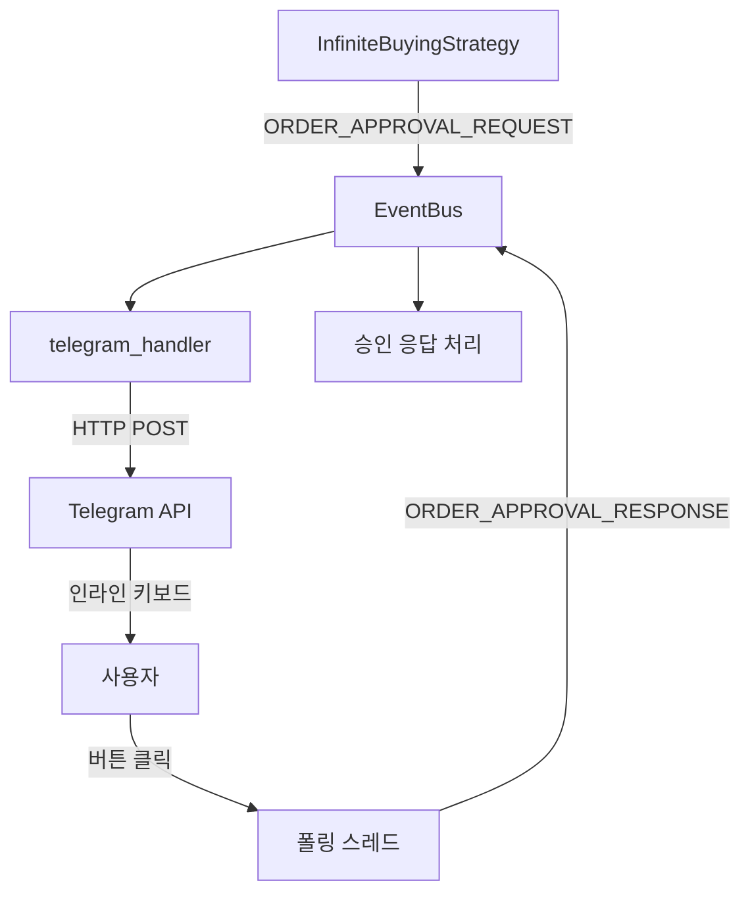

# 텔레그램 메시지 전송 방식 가이드

이 문서는 프로젝트 내에서 텔레그램 메시지를 보내는 두 가지 방식과 그 사용 이유를 설명합니다.

## 핵심: 실행 컨텍스트(동기 vs 비동기)에 따라 다른 방식을 사용

결론부터 말하면, 어떤 방식을 사용할지는 **메시지를 보내는 코드가 동기(Synchronous) 환경에서 실행되는지, 비동기(Asynchronous) 환경에서 실행되는지에 따라 결정됩니다.**

---

### 1. 동기(Sync) 환경: `httpx`를 이용한 직접 HTTP 호출

이 방식은 현재 프로젝트의 주된 메시지 전송 방식입니다.

-   **사용 파일:** `src/utils/telegram_handler.py`
-   **대표 메서드:** `send_message_sync()`

#### 언제 사용하나요?

-   Streamlit UI의 버튼 클릭과 같이 동기적으로 처리되는 이벤트에 대한 응답을 보낼 때.
-   `EventBus`를 통해 전달된 이벤트를 처리하는 핸들러 내부에서 메시지를 보낼 때.
-   **즉, 애플리케이션의 메인 실행 흐름(동기 코드) 안에서 메시지를 보내야 할 때 사용합니다.**

#### 왜 `python-telegram-bot` 라이브러리를 직접 쓰지 않나요?

-   **`Streamlit`은 동기(Sync) 방식**으로 작동하는 반면, **`python-telegram-bot` (v20+) 라이브러리는 비동기(Async) 방식**으로 작동합니다.
-   동기 코드 안에서 비동기 함수(`await bot.send_message()`)를 호출하는 것은 `asyncio` 이벤트 루프를 직접 관리해야 하는 복잡성을 야기하며, 애플리케이션 전체를 멈추게 할 위험이 있습니다.
-   `httpx`를 사용하면 이러한 동기/비동기 충돌 문제 없이, 가장 간단하고 안정적으로 메시지를 전송할 수 있습니다.

---

### 2. 비동기(Async) 환경: `python-telegram-bot` 라이브러리 직접 사용

-   **사용 파일:** `src/utils/telegram.py`
-   **대표 메서드:** `async def send_message()`

#### 언제 사용할 수 있나요?

-   별도의 스레드에서 `asyncio` 이벤트 루프를 실행하고, 그 안에서 독립적으로 작동하는 비동기 작업이 있을 경우에 가장 적합합니다.
-   예를 들어, 한국투자증권 API의 실시간 시세 데이터를 받는 WebSocket 클라이언트를 `asyncio` 기반으로 구현했다면, 그 내부에서 `await bot.send_message()`를 호출하는 것이 자연스럽습니다.

#### 왜 이 방식도 존재하나요?

-   `python-telegram-bot` 라이브러리가 제공하는 모든 기능(인라인 키보드, 대화형 기능 등)을 온전히 활용할 수 있습니다.
-   이미 비동기 환경으로 구성된 곳에서는 이 방식이 가장 효율적입니다.
-   (`참고: 현재 아키텍처에서는 `telegram_handler.py`가 주로 사용되므로, 이 파일은 레거시 코드로 볼 수 있습니다.`)

---

## 3. 텔레그램 폴링 시스템 (주문 승인용)

### 📊 **폴링 시스템 특징**

-   **사용 파일:** `src/utils/telegram.py`
-   **주요 메서드:** `_start_polling()`, `request_order_approval()`
-   **목적:** 실시간 주문 승인 처리

### ⏰ **폴링 간격 및 성능**

#### **폴링 주기: 0.2초마다**
```python
# 텔레그램 폴링 (src/utils/telegram.py)
time.sleep(0.2)  # 매 0.2초마다 폴링
```

#### **시스템 전체 대기 없음!**
- **독립 스레드**: `daemon=True`로 백그라운드 실행
- **비블로킹**: 다른 컴포넌트에 영향 없음
- **경량**: HTTP 요청만으로 구성

### 🧵 **완전 독립적인 스레드 구조**

```python
# 각 컴포넌트가 별도 스레드에서 실행
메인 스레드        : Streamlit UI + 전략 실행
├── 텔레그램 스레드  : 0.2초마다 폴링 (주문 승인)
├── 시세 스레드     : 60초마다 가격 조회 (StockSubscriber)
└── 기타 스레드     : WebSocket, 스케줄러 등
```

### 📈 **성능 영향 분석**

#### **리소스 사용량 (매우 경량)**
- **CPU**: 0.2초마다 HTTP 요청 1회
- **메모리**: 스레드 1개 (~8MB)
- **네트워크**: 초당 5회 × 1KB = 5KB/s

#### **다른 컴포넌트와의 독립성**
```python
# 텔레그램 폴링 중에도 다른 작업 정상 진행
while self.webhook_running:
    response = requests.get(url, timeout=3)  # 3초 타임아웃
    # ↑ 이 시간 동안에도 StockSubscriber, UI 등은 정상 동작
    time.sleep(0.2)
```

### 🎯 **장점**

1. **독립성**: 각 컴포넌트가 서로 방해하지 않음
2. **안정성**: 한 스레드 문제가 전체에 영향 안줌  
3. **실시간성**: 0.2초 간격으로 빠른 반응
4. **확장성**: 새 스레드 추가해도 기존 영향 없음
5. **경량성**: Flask 없이 순수 requests만 사용

---

## 4. EventBus 기반 주문 승인 시스템 (재작성 완료)

### 📋 **시스템 재구성 개요**

권장사항에 따라 주문 승인 시스템을 EventBus 중심 구조로 **완전히 재작성**했습니다.

#### **변경 전 (기존 방식)**
```python
# ❌ 직접 호출 방식 - 아키텍처 일관성 위반
class InfiniteBuyingStrategy:
    def _execute_orders(self):
        # 직접 텔레그램 호출
        self.telegram.request_order_approval(orders, callback)
```

#### **변경 후 (EventBus 방식)**
```python
# ✅ EventBus 중심 - 아키텍처 일관성 유지
class InfiniteBuyingStrategy:
    def _execute_orders(self):
        # EventBus를 통한 이벤트 발행
        self.event_bus.dispatch(Event(
            type=EventType.ORDER_APPROVAL_REQUEST.value,
            source="infinite_buying_strategy",
            action="request_approval",
            data={
                "orders": all_orders,
                "callback_id": callback_id,
                "timeout": 300
            }
        ))
```

### 🔄 **이벤트 흐름**



### 🛠️ **구현 세부사항**

#### **1. EventBus 이벤트 타입 추가**
```python
# src/utils/event_bus.py
class EventType(Enum):
    ORDER_APPROVAL_REQUEST = "ORDER_APPROVAL_REQUEST"
    ORDER_APPROVAL_RESPONSE = "ORDER_APPROVAL_RESPONSE"
```

#### **2. telegram_handler.py 주문 승인 기능 통합**
```python
# src/utils/telegram_handler.py
class telegram_handler:
    def _setup_event_handlers(self):
        # 주문 승인 요청 이벤트 구독
        self.event_bus.subscribe(
            EventType.ORDER_APPROVAL_REQUEST.value,
            lambda event: self._handle_event(event, self._process_approval_request)
        )
    
    def _process_approval_request(self, event: Event):
        """EventBus 이벤트를 통한 주문 승인 요청 처리"""
        orders = event.data.get("orders", [])
        callback_id = event.data.get("callback_id")
        
        # 동기식 텔레그램 메시지 전송
        order_id = self._request_order_approval_sync(orders, callback_id)
```

#### **3. 응답 처리 (EventBus 방식)**
```python
def _process_callback_sync(self, callback_query):
    """사용자 버튼 클릭 처리 후 EventBus로 응답 전송"""
    # EventBus로 승인 응답 전송
    self.event_bus.dispatch(Event(
        type=EventType.ORDER_APPROVAL_RESPONSE.value,
        source="telegram_handler",
        action="approved" if approved else "rejected",
        data={
            "callback_id": approval.callback,
            "approved": approved,
            "orders": approval.orders,
            "order_id": order_id
        }
    ))
```

### 🎯 **재작성의 장점**

| 측면 | 기존 방식 | EventBus 방식 |
|------|----------|--------------|
| **일관성** | 별도 구현 | 전체 아키텍처와 통합 |
| **확장성** | 제한적 | 새 이벤트 쉽게 추가 |
| **테스트** | 복잡 | EventBus 모킹으로 간단 |
| **디버깅** | 어려움 | 중앙 집중식 로깅 |
| **유지보수** | 분산된 코드 | 단일 위치 관리 |

### 📁 **파일 구조 변화**

#### **주요 역할 분담**
- **`telegram_handler.py`**: 모든 텔레그램 기능 (일반 알림 + 주문 승인)
- **`telegram.py`**: 기본 메시지 전송만 (주문 승인 기능 제거됨)
- **`infinite_buying.py`**: EventBus 이벤트 발행 + 응답 처리

#### **제거된 기능**
```python
# telegram.py에서 제거됨
- class OrderApproval
- request_order_approval()
- _start_polling()
- _process_callback_directly()
- 모든 주문 승인 관련 메서드들
```

### ✅ **검증 완료**

EventBus 기반 시스템이 정상 동작함을 확인:
```bash
INFO:src.utils.telegram_handler:🎯 주문 승인 요청 이벤트 수신: test_script -> request_approval
INFO:src.utils.telegram_handler:📋 주문 수: 2, 콜백ID: test_callback_12345, 타임아웃: 60초
INFO:httpx:HTTP Request: POST https://api.telegram.org/bot...sendMessage "HTTP/1.1 200 OK"
```

---

### 결론 및 권장 사항

**현재 프로젝트는 `EventBus`를 중심으로 모든 컴포넌트가 통신하는 구조입니다. 따라서 새로운 텔레그램 알림 기능을 추가할 때는 `src/utils/telegram_handler.py` 파일에 `httpx`를 사용하는 새로운 `send_..._sync` 메서드를 만드는 것이 전체 아키텍처의 일관성을 유지하는 가장 좋은 방법입니다.**

**주문 승인 시스템은 EventBus 권장사항에 따라 완전히 재작성되어, 이제 `telegram_handler.py`를 통해 일관된 방식으로 처리됩니다. 이는 시스템 전체 성능에 거의 영향을 주지 않으면서도 향후 확장성과 유지보수성을 크게 향상시킵니다.**
