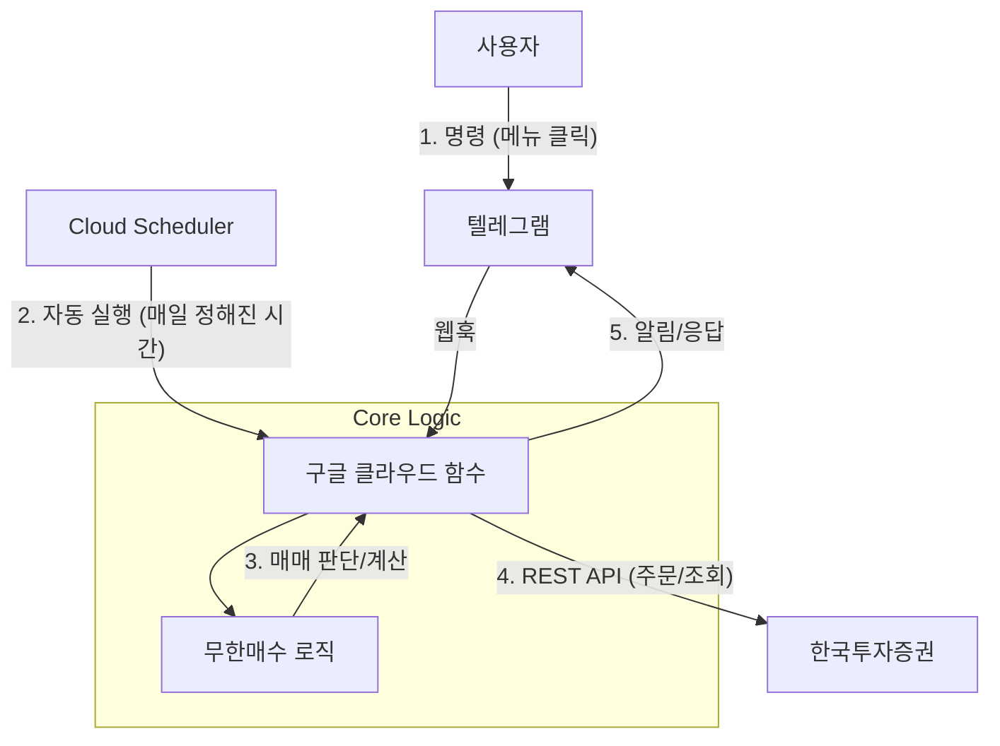

# 문서화 계획: 무한매수 람다 텔레그램 봇 ReadMe

## 목표 설명
서버리스 트레이딩 봇의 아키텍처, 설정 및 사용 방법을 설명하는 포괄적인 `무한매수_람다_텔레그램_ReadMe.md` 파일을 작성합니다.
사용자의 피드백을 반영하여 **Cloud Scheduler를 이용한 자동 알림** 기능을 포함합니다.

## 제안된 목차 구성

### 1. 프로젝트 개요 (Project Overview)
- **목표**: 서버리스 아키텍처를 사용하여 라오어의 무한매수법 전략을 실행합니다.
- **특징**:
    - **서버리스**: 구글 클라우드 함수(Lambda) 사용으로 비용 효율성 극대화.
    - **자동 알림**: 매일 프리장 시작 전(오후 6시/10시 등 설정 가능) 봇이 먼저 말을 걸어 매매 준비 알림.
    - **간편 제어**: 텔레그램 메뉴 버튼으로 손쉬운 확인 및 조작.

### 2. 시스템 아키텍처 (System Architecture)

### 3. 주요 기능 (Telegram Menu)
1.  **계좌 조회**: 잔고, 평단가, 수익률 조회.
2.  **사이클 상황보고**: 현재 회차(T), 진행률(%), 목표/Star 가격 조회.
3.  **오늘의 주문예약**: 로직에 따른 매수/매도(LOC/AfterMarket) 주문 계산.
4.  **오늘의 체결상황**: 당일 체결된 주문 내역 조회.
5.  **자동 알림**: 스케줄러에 의해 "안녕하세요? 오늘 전략예약 시간입니다" 알림 및 메뉴 자동 호출.

### 4. 폴더 구조 (`src_tele_lamda`)
- `main.py`: 텔레그램 웹훅 및 스케줄러 트리거 처리.
- `config/`: 설정 파일.
- `src_rev/`: 핵심 로직.

### 5. 배포 가이드 (Deployment Guide)
- **사전 준비**: GCP 프로젝트, KIS API 키, 텔레그램 봇 토큰.
- **설정**: `config.yaml` 파일 설정.
- **Cloud Functions 배포**: 봇 로직 배포.
- **Cloud Scheduler 설정**:
    - 빈도: 매일 특정 시간 (예: `0 18 * * 1-5` - 평일 오후 6시).
    - 타겟: 배포된 Cloud Function URL.
    - 페이로드: `{"type": "schedule_trigger"}` 등.

### 6. 사용 예시 (Usage Interactions)
- 스케줄러 알림 메시지 예시.
- 메뉴 버튼 클릭 반응 예시.

## 사용자 리뷰 필요 사항
- Cloud Scheduler 설정 부분의 내용이 사용자 의도(자동 시동)와 맞는지 확인 부탁드립니다.
